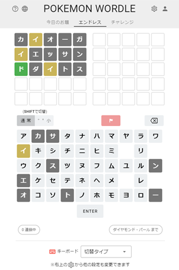
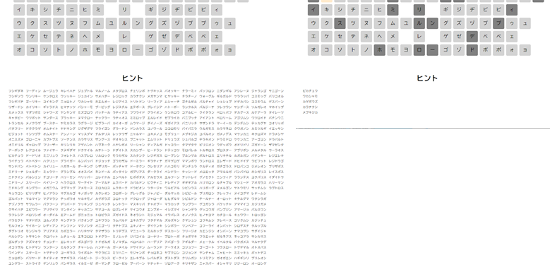
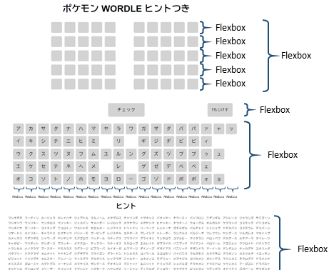

# ポケモンWORDLEヒントつき

## これは何？

ヒント付きのPOKEMON WORDLEです。

POKEMON WORDLEの本家は[こちら](https://wordle.mega-yadoran.jp/)

## POKEMON WORDLEとは

お題のポケモンの名前を当てるゲーム

ポケモン大好きな子供（7歳と5歳）と一緒にやってみたら楽しい！

ただ、子供にはちょっと難しかったみたいです。ほとんど当てることができませんでした（楽しんではいましたが）。

## ヒント付きのPOKEMON WORDLEを作ってみた

子供が正解を導き出せるヒント付きのポケモンWORDLEを作ってみました。

### 工夫したところ

#### ヒントが出る

使える文字が減少すると、それに合わせてヒントのポケモンが絞られるようになっています。

フィルター関数大活躍です。

#### 要素の配置はFlexbox

Flexboxを知らなかったらそもそも作ろうとは考えなかったと思います。

大活躍でした。

#### メッセージ枠の配置

メッセージ枠をキーボード前面に配置するのに苦労しましたが、結局キーボード下に配置してから「margin-top: -200」といった感じでマージンの値をマイナスにすることで実現できました。

## 実際に遊んでみた

## まとめ

ヒント付きのポケモンWORDLEを作ってみました。

子供も楽しんで遊んでいます。

