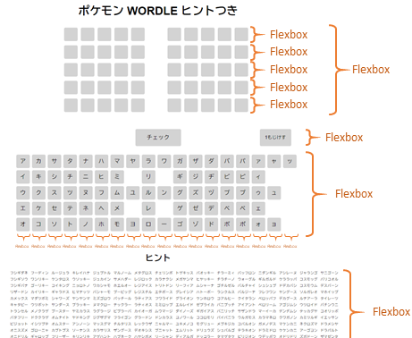
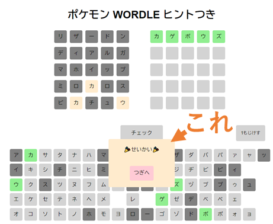

# ポケモンWORDLEヒントつき

## これは何？

ヒント付きのPOKEMON WORDLEです。

POKEMON WORDLEの本家は[こちら](https://wordle.mega-yadoran.jp/)
  

## POKEMON WORDLEとは

お題のポケモンの名前を当てるゲーム

ポケモン大好きな子供（7歳と5歳）と一緒にやってみたら楽しい！

ただ、子供にはちょっと難しかったみたいです。ほとんど当てることができませんでした（楽しんではいましたが）。

  

## ヒント付きのPOKEMON WORDLEを作ってみた

子供が正解を導き出せるヒント付きのポケモンWORDLEを作ってみました。
  

### 工夫したところ
### ヒントが出る

ヒントとして最初は全ポケモン（514種！）が表示されますが、使える文字が減少すると、それに合わせてヒントのポケモンが絞られるようになっています。

フィルター関数大活躍です。
  

### 要素の配置はFlexbox

Flexboxを知らなかったらそもそも作ろうとは考えなかったと思います。

大活躍でした。
  

### メッセージ枠の配置

メッセージ枠をキーボード前面に配置するのに苦労しました。

結局、一旦キーボード下に配置してから「margin-top: -300」といった感じでマージンの値をマイナスにすると上手くいきました。
  

## 実際に遊んでみた

子供は楽しんで遊んでいます！

大人にはちょっと簡単すぎたかなと。回答チャンスを5回ぐらいに減らすと良いかもしれません。
  

## まとめ

・ヒント付きのポケモンWORDLEを作ってみました

・Flexboxは偉大

・ゲーム作るの楽しい

しばらく子供と一緒に楽しんで遊ぼうと思います。

